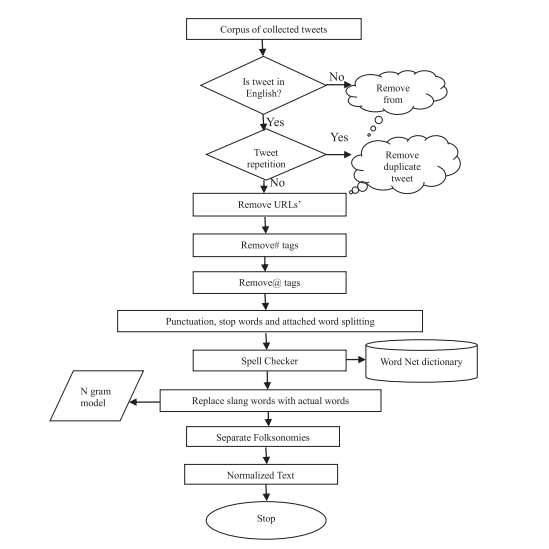

# Sociologer
It is a Social Media Mining Tool.
Preprocessing of Short text that users use on social media platforms and after that getting insights from the textual preprocessed data.  
Preprocessing includes:
* Extraction (Tokenizing)
* Stop words removal
* Stemming and Lemmatization

### Step 1
Developing an algorithm that will implement the above methodology. (using libraries like Regex, NLTK, String)
Generating a tweet database and learning the methodology of how preprocessing should be done. This is a crucial step and requires removing unwanted data (stopwords, redundant words etc.) from tweets and emphasizing important words that contribute more to the essence of the tweet. Also, it should be able to detect duplicate tweets and remove the copies from the corpus of processed tweets.

### Step 2
Implementing the above algorithm on test tweet database to see if this is working fine on other short texts as well, tweak the algorithm as required.

### Step 3
After preprocessing algorithm is done, an algorithm is to be developed along with a Classifier so that our machine can learn the process.

### Step 4
Engine has to be build to carry out analysis from the text as well as other data that can be extracted from social media platforms so as to have meaningful insight.

### Step 5
Packaging is to be done so that it can be moulded in the form of a module.

### Step 6
Build basic User Interface after that.
